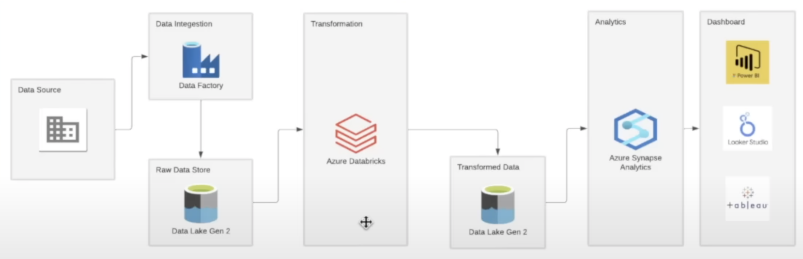

# Tokyo Olympics Data Engineering Project

 This project is about performing ETL tasks on Olympic Data from Kaggle using Azure services.

<h3>Below is the architecture used: </h3>

<h3>Steps executed:</h3>

<li> Create Azure Data Factory Pipeline to move data from source (github repo) to Data Lake Gen2</li>
<li> Create Azure DataBricks Spark cluster and mount the Gen2 storage on it (create IAM role to access the files). Perform necessary transformations on the data and write back to Gen2 storage</li>
<li> Connect Gen2 storage to Azure Synapse Analytics to perform Data Analysis </li>
<li> (future scope) Connect Synapse to a visualization tool to build dashboards</li>
